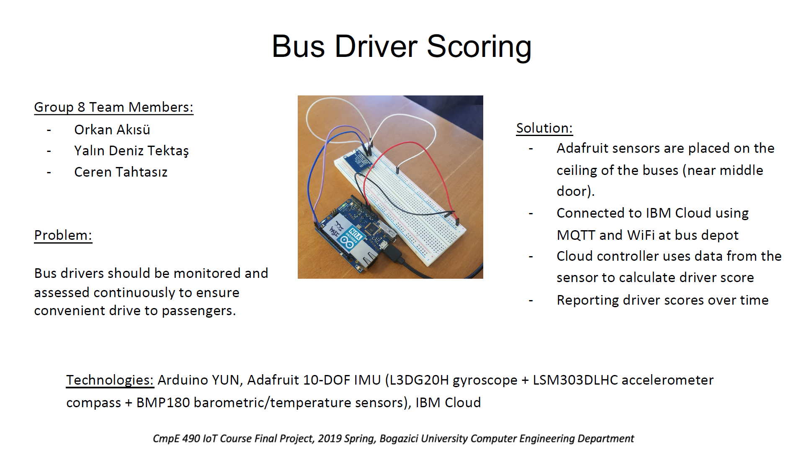
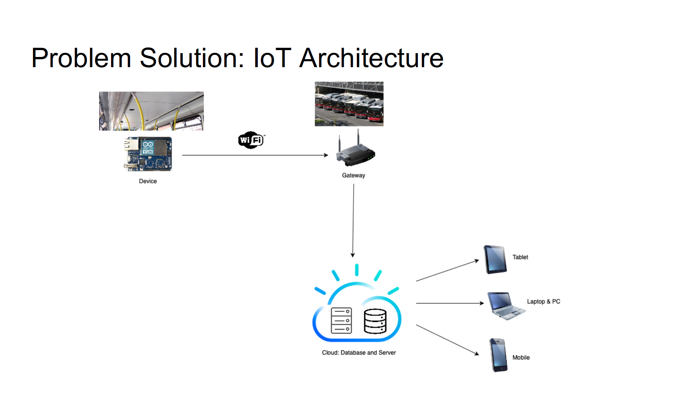
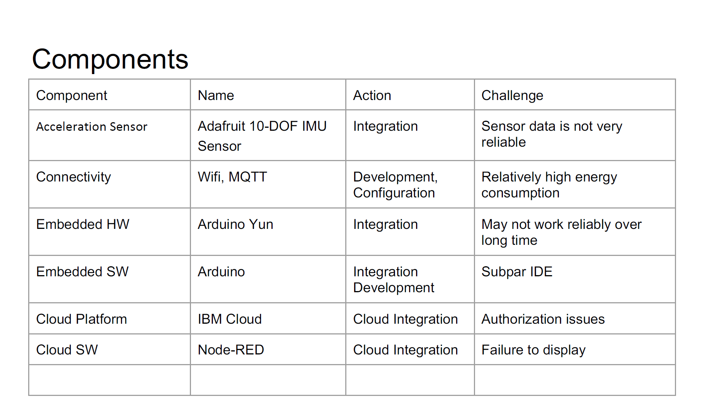
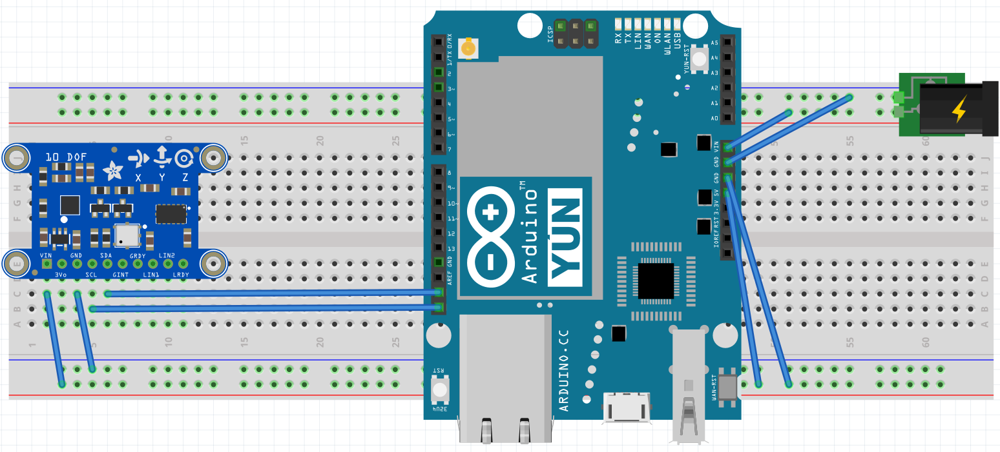

# Driver Scoring

# Sketch

# Problem Definition
Passengers who use public transportation has a right to have a safe and convenient drive but there are negligent drivers who cause risk and discomfort to traffic and passengers. There’s no portable and autonomous measuring device for continuous and objective on-board comfort measurements on local transport buses. Without any supervision, this problem will continue to arise. 

# Problem Solution
We gather the data by using Arduino Yun and Adafruit 10 DOF IMU's LSM303DLHC accelerometer module. We send our data via Wi-Fi, using MQTT, to IBM's cloud service Bluemix and display the result with Node-RED. These data are processed according to a passenger comfort index in EN 12299 regulation. The end of these process reporting driver scores over time.

## Team members
### Orkan Akısü
I am a senior student in Computer Engineering at Boğaziçi University. I have been interested in quantum compıting and video game design.

#### Skills
* C/C++, C#, Python, Java
* MATLAB
* Unity

#### Contact 
* Mail: orkan.akisu@gmail.com
* LinkedIn: https://www.linkedin.com/in/orkan-akısü-51509b142
* Github: https://github.com/orkana

### Ceren Tahtasız
Currently, I am a senior student in Computer Engineering at Bogazici University. Lately, I am interested in software architecture and project management. I dance, photograph, travel and read in my free time.

#### Skills
* C/C++, Java
* SQL
* MATLAB

#### Contact 
* Mail: cerentahtasiz@gmail.com
* LinkedIn: www.linkedin.com/in/ceren-tahtasiz
* Github: https://github.com/cerentahtasiz

### Yalın Deniz Tektaş
Yalın Deniz Tektas
I am senior mechanical engineering student at Bogazici University I will graduate in June 2020. I have an intermediate knowledge in Android programming and Python programming languages. I am also interested in innovations in the world of iot.
#### Skills
* C, Python

#### Contact 
* Mail: y.deniztektas@gmail.com
